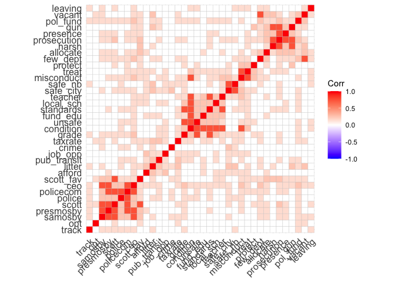
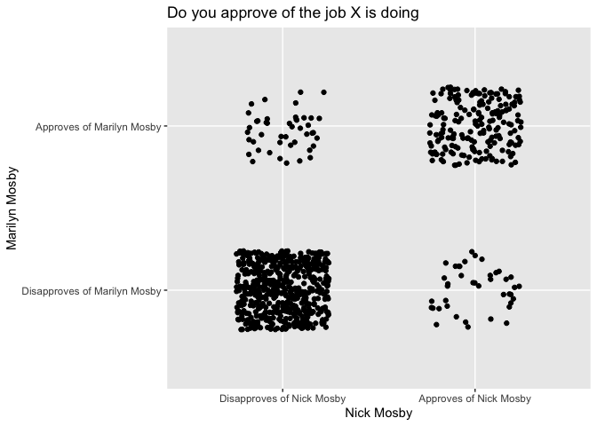
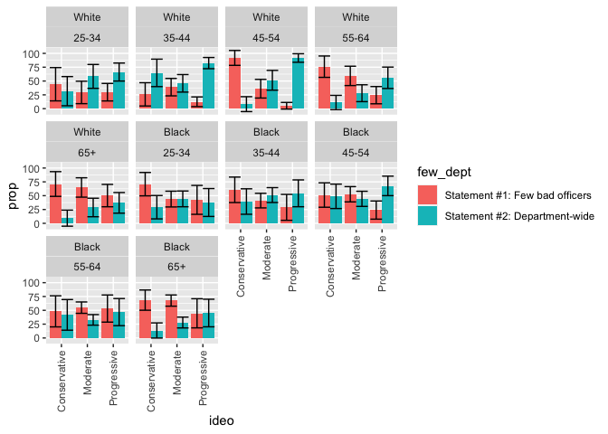
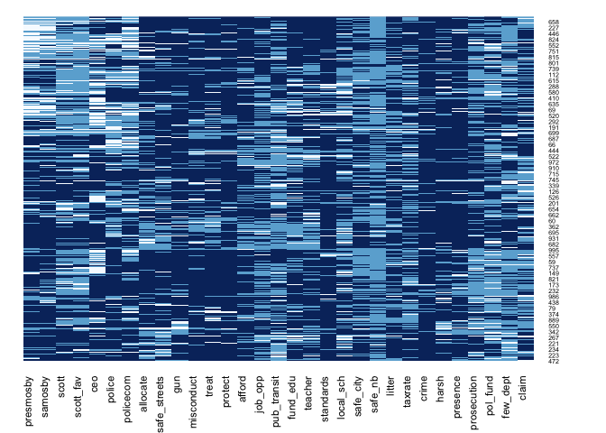

A deeper dive into The Baltimore Banner poll
================
Nick Thieme
2022-06-16

## What the Baltimore Now polls tells us about how city residents share opinions

### Library and data load

This is R code that goes along with The Baltimore Banner story “What the
Baltimore Now poll tells us about how city residents share opinions”
available at: INSERT LINK

The data analysis is relatively straightforward throughout, using the
srvyr package to do the heavy lifting of accounting for polling weights
in the calculations of standard errors. We use the survey package just
once for calculating a correlation matrix.

### Correlation plot

There’s quite a bit of interesting structure in the poll responses and
this structure guides a good bit of the ultimate story. By thresholding
the correlation matrix and looking for blocks of questions that poll
together, we can find some interesting relationships between different
questions and Baltimoreans’ responses.

<!-- -->

This shows three main blocks of questions that poll together. One
related to politicians, generally, and the Mosbys specifically, another
related to questions about the schools, and a third block related to
criminal justice and prosecution of crimes. Looking at the topline
findings shows that these blocks aren’t the only things Baltimore cares
about, there are other subjects that the city has even stronger feelings
about. Instead, what it shows us, is that “opinion groups” have formed
around these questions. Baltimorean’s are in some way split into
different groups by these questions. We explore a little in how they’re
split by these topics in this story.

### Groups of people with similar opinions

These are the percentages reported in the story. I won’t repeat the
writing there.

``` r
srs_design %>%filter(presmosby>2,presmosby<88) %>%  group_by(interact(presmosby, samosby)) %>%
  summarise(prop = survey_prop()) %>% filter(samosby>2, samosby<88) %>% pull(prop) %>% sum
```

    ## [1] 0.7852113

``` r
srs_design %>%filter(presmosby<3,presmosby<88) %>%  group_by(interact(presmosby, samosby)) %>%
  summarise(prop = survey_prop()) %>% filter(samosby>2, samosby<88) %>% pull(prop) %>% sum
```

    ## [1] 0.07813524

``` r
srs_design %>%filter(presmosby>2,presmosby<88) %>%  group_by(interact(presmosby, scott)) %>%
  summarise(prop = survey_prop()) %>% filter(scott>2, scott<88) %>% pull(prop) %>% sum
```

    ## [1] 0.709818

``` r
srs_design %>%filter(presmosby>2,presmosby<88) %>%  group_by(interact(presmosby, policecom)) %>%
  summarise(prop = survey_prop()) %>% filter(policecom>2, policecom<88) %>% pull(prop) %>% sum
```

    ## [1] 0.4750692

``` r
srs_design %>%filter(presmosby>2,presmosby<88) %>%  group_by(interact(presmosby, ceo)) %>%
  summarise(prop = survey_prop()) %>% filter(ceo>2, ceo<88) %>% pull(prop) %>% sum
```

    ## [1] 0.4512012

``` r
poll_dat_mos<-D_poll_results %>% filter(presmosby<5, samosby<5) %>% 
  mutate(samosby=case_when(samosby%in%c(1,2)~1,samosby%in%c(3,4)~2),
         presmosby=case_when(presmosby%in%c(1,2)~1,presmosby%in%c(3,4)~2),
         pres_mosby_j = jitter(presmosby, 1.2),
         samosby_j = jitter(samosby, 1.2),
         samosby=case_when(samosby==1~"dislikes_sa",samosby==2~"likes_sa"),
         presmosby=case_when(presmosby==1~"Dislikes Nick Mosby",presmosby==2~"Likes Nick Mosby"),
 
        ) %>% select(pres_mosby_j, samosby_j, presmosby, samosby) 

poll_dat_mos %>% 
  ggplot(aes(x = pres_mosby_j, y = samosby_j))+geom_point()+
  scale_x_discrete(limits=c("Disapproves of Nick Mosby","Approves of Nick Mosby"))+
  scale_y_discrete(limits=c("Disapproves of Marilyn Mosby","Approves of Marilyn Mosby"))+
  labs(x = "Nick Mosby", y = "Marilyn Mosby", title = "Do you approve of the job X is doing")
```

<!-- -->

### What’s wrong with the Baltimore Police

Like before, this is the calculation of the percentages that go along
with the figures in the story.

These correspond to respondents attitudes on greater prosecution of
nonviolent offenses and a variety of other crime-reduction measures
polled.

``` r
srs_design %>%filter(prosecution%in%c(3,4)) %>%  group_by(interact(prosecution, harsh)) %>%
  summarise(prop = survey_prop()) %>% filter(harsh%in%c(3,4)) %>% pull(prop) %>% sum
```

    ## [1] 0.9275239

``` r
srs_design %>%filter(prosecution%in%c(1,2)) %>%  group_by(interact(prosecution, harsh)) %>%
  summarise(prop = survey_prop()) %>% filter(harsh%in%c(3,4)) %>% pull(prop) %>% sum
```

    ## [1] 0.6872575

``` r
srs_design %>%filter(prosecution%in%c(3,4)) %>%  group_by(interact(prosecution, allocate)) %>%
  summarise(prop = survey_prop()) %>% filter(allocate%in%c(3,4)) %>% pull(prop) %>% sum
```

    ## [1] 0.6323784

``` r
srs_design %>%filter(prosecution%in%c(1,2)) %>%  group_by(interact(prosecution, allocate)) %>%
  summarise(prop = survey_prop()) %>% filter(allocate%in%c(3,4)) %>% pull(prop) %>% sum
```

    ## [1] 0.7654517

``` r
srs_design %>%filter(pol_fund%in%c(3)) %>%  group_by(interact(pol_fund, allocate)) %>%
  summarise(prop = survey_prop()) %>% filter(allocate%in%c(3,4)) %>% pull(prop) %>% sum
```

    ## [1] 0.6237594

We also examine how Baltimore’s view of the issues in the police
department (are they systemic or limited to a few bad apples) depends on
race, age, and ideology.

All confidence intervals (read, significance testing) here is done at
the 90% (10%) level. We’re using a slightly lowered probability level
because we’d like to highlight potentially interesting differences as
different.

``` r
plot_data_1<-srs_design %>% group_by(interact(race_cat, ideo, age), few_dept) %>% 
  summarise(prop=survey_prop(vartype="ci", level = .9))#

plot_data_2_r<-plot_data_1%>%
  filter(race_cat%in%c(1,2), ideo %in%c(1,2,3), few_dept%in%c(1,2),age!=1 ) %>% na.omit %>% 
  mutate(race_cat = as_factor(race_cat), ideo = as_factor(ideo), few_dept = as_factor(few_dept),
         age = as_factor(age)) %>% group_by(race_cat, age) %>% 
  mutate(chart_group = cur_group_id()) %>% ungroup %>% 
  mutate(cat_title = str_c(race_cat, ", ",age),
         prop = prop*100,prop_low = prop_low*100, prop_upp=prop_upp*100) 

plot_data_2_flou<-plot_data_2_r%>% 
  pivot_wider(names_from = few_dept, values_from = c(prop, prop_low, prop_upp)) %>% repair_names()

plot_data_2_r %>% filter(race_cat == "White", age=="45-54", ideo%in%c("Conservative","Progressive"))
```

    ## # A tibble: 4 × 9
    ##   race_cat ideo     age   few_dept  prop prop_low prop_upp chart_group cat_title
    ##   <fct>    <fct>    <fct> <fct>    <dbl>    <dbl>    <dbl>       <int> <chr>    
    ## 1 White    Conserv… 45-54 Stateme… 91.8    78.3      105.            3 White, 4…
    ## 2 White    Conserv… 45-54 Stateme…  8.20   -5.28      21.7           3 White, 4…
    ## 3 White    Progres… 45-54 Stateme…  5.29   -0.762     11.3           3 White, 4…
    ## 4 White    Progres… 45-54 Stateme… 91.6    83.9       99.4           3 White, 4…

Here is the plot that corresponds to the department/race/age/ideology
chart in the story. You can see the confidence intervals plotted on this
chart that correspond to the significance annotations put online.

``` r
names(plot_data_2_flou)[6]<-"A few bad officers"
names(plot_data_2_flou)[7]<-"Departmentwide"
names(plot_data_2_flou)[8]<-"few_bad_l"
names(plot_data_2_flou)[9]<-"dept_wide_l"
names(plot_data_2_flou)[10]<-"few_bad_h"
names(plot_data_2_flou)[11]<-"dept_wide_h"

plot_data_2_r%>% 
  ggplot(aes(x = ideo, y = prop, fill = few_dept))+
  geom_bar(position="dodge", stat="identity")+
  geom_errorbar(aes(ymin=prop_low, ymax = prop_upp, x = ideo), position="dodge")+
  facet_wrap(~race_cat+age)+
  theme(axis.text.x = element_text(angle = 90, vjust = 0.5, hjust=1))
```

<!-- -->

### Heatmap

Finally, here we present the heatmap that goes with the story. I haven’t
seen anyone use a heatmap to present a survey before, but I think it’s
an interesting way to go about things. It’s worth mentioning that this
plot is really just an illustration of what’s happening in the survey
for a variety of reasons.

First off, we’re not taking weights into account here. Normally, that’s
a pretty big deal, however, because the sampled population happened to
be quite close to Baltimore’s population on the measures weighted for,
the largest sample weight in the survey is 2.63. So, it’s a pretty close
representation.

We’re also aggregating individual opinions to present opinions in blocks
of 50 for the chart online. This also introduces a bit of smoothing into
the chart.

However, the lessons gleaned from the heatmap are similar to the lessons
one sees upon a close examination of the data, but without having to
examing 30-some variables (or charts) by hand.

We also use a dendogram-based sorting algorithm to sort columns and rows
in a way that visually groups similar blocks of respondents and
questions to make reading the heatmap easier than it would be otherwise.

Before that, though, here are the calculations for the total
dissatisfaction and Santelises statistics.

``` r
D_for_diff=srs_design %>%mutate(
  opt = case_when(opt%in%c(1,2)~2,
                  opt%in%c(3,4)~1),
  
  scott = case_when(scott%in%c(1,2)~2,
                    scott%in%c(3,4)~1),
  
  presmosby = case_when(presmosby%in%c(1,2)~2,
                        presmosby%in%c(3,4)~1),
  
  samosby = case_when(samosby%in%c(1,2)~2,
                      samosby%in%c(3,4)~1),
  
  police = case_when(police%in%c(1,2)~2,
                     police%in%c(3,4)~1),
  
  policecom = case_when(policecom%in%c(1,2)~2,
                        policecom%in%c(3,4)~1),
  
  ceo = case_when(ceo%in%c(1,2)~2,
                  ceo%in%c(3,4)~1),
  
  scott_fav = case_when(scott_fav%in%c(1,2)~2,
                        scott_fav%in%c(3,4)~1),
  
  afford = case_when(afford%in%c(1,2)~1,
                     afford%in%c(3)~2),  
  
  litter = case_when(litter%in%c(1,2)~1,
                     litter%in%c(3)~2),  
  
  pub_transit = case_when(pub_transit%in%c(1,2)~1,
                          pub_transit%in%c(3)~2),  
  
  job_opp = case_when(job_opp%in%c(1,2)~1,
                      job_opp%in%c(3)~2),  
  
  crime = case_when(crime%in%c(1,2)~1,
                    crime%in%c(3)~2), 
  
  taxrate = case_when(taxrate%in%c(1,2)~1,
                      taxrate%in%c(3)~2), 
  
  grade = case_when(grade%in%c(1,2,3,4)~1,
                    grade%in%c(5)~2), 
  
  condition = case_when(condition%in%c(1,2)~1,
                        condition%in%c(3)~2), 
  
  unsafe = case_when(unsafe%in%c(1,2)~1,
                     unsafe%in%c(3)~2), 
  
  fund_edu = case_when(fund_edu%in%c(1,2)~1,
                       fund_edu%in%c(3)~2), 
  
  standards = case_when(standards%in%c(1,2)~1,
                        standards%in%c(3)~2), 
  
  local_sch = case_when(local_sch%in%c(1,2)~1,
                        local_sch%in%c(3)~2), 
  
  teacher = case_when(teacher%in%c(1,2)~1,
                      teacher%in%c(3)~2), 
  
  safe_city = case_when(safe_city%in%c(1,2)~2,
                        safe_city%in%c(3,4)~1), 
  
  safe_nb = case_when(safe_nb%in%c(1,2)~2,
                      safe_nb%in%c(3,4)~1), 
  
  misconduct = case_when(misconduct%in%c(1,2)~2,
                         misconduct%in%c(3,4)~1), 
  
  treat = case_when(treat%in%c(1,2)~2,
                    treat%in%c(3,4)~1), 
  
  protect = case_when(protect%in%c(1,2)~2,
                      protect%in%c(3,4)~1), 
  
  few_dept = case_when(few_dept%in%c(1)~2,
                       few_dept%in%c(2)~1), 
  
  allocate = case_when(allocate%in%c(1,2)~1,
                       allocate%in%c(3,4)~2), 
  
  harsh = case_when(harsh%in%c(1,2)~1,
                    harsh%in%c(3,4)~2), 
  
  prosecution = case_when(prosecution%in%c(1,2)~1,
                          prosecution%in%c(3,4)~2), 
  
  safe_streets = case_when(safe_streets%in%c(1,2)~1,
                           safe_streets%in%c(3,4)~2), 
  
  presence = case_when(presence%in%c(1,2)~1,
                       presence%in%c(3,4)~2), 
  gun = case_when(gun%in%c(1,2)~1,
                  gun%in%c(3,4)~2), 
  
  pol_fund = case_when(pol_fund%in%c(1,2)~1,
                       pol_fund%in%c(3)~2)
) 

D_new<-D_for_diff$variables%>% select(-`case#`, -weight, - phone_type, -agequal, -reside, - condition,
                               -unsafe, -vacant_other, -reason_other,-like_oe, -starts_with("reason"),
                               -starts_with("leave"), -starts_with("race"), -nr_zip_01, 
                               -nr_like_01, -qzipcode, -income,-income_6, - educ, - age,
                               -year, -year_age, -grade, -lived, -ends_with("_2"), -gender, -EDUC_3,
                               -regvote, -ideo, -raised, - parent, -track, -opt, - leaving,-vacant,
                               
                               ) %>% 
  mutate_all(as.numeric) %>% as.matrix

D_new[is.na(D_new)]<-0
D_new[D_new>10]<-0

row_dist <- as.dist(1-cor(t(D_new), method = "pearson"))
col_dist <- as.dist(1-cor(D_new, method = "pearson"))

col_hc <- hclust(col_dist, method = "complete")
row_hc <- hclust(row_dist, method = "complete")
```

``` r
length(which(D_new==2))/length(D_new)
```

    ## [1] 0.6206941

``` r
srs_design %>% filter(parent%in%c(1,2)) %>% group_by(parent, ceo) %>% summarise(survey_prop()) %>% filter(ceo==88)
```

    ## # A tibble: 2 × 4
    ## # Groups:   parent [2]
    ##      parent                  ceo  coef  `_se`
    ##   <dbl+lbl>            <dbl+lbl> <dbl>  <dbl>
    ## 1   1 [No]  88 [(VOL) Dont know] 0.188 0.0164
    ## 2   2 [Yes] 88 [(VOL) Dont know] 0.107 0.0202

``` r
heatmap.2(D_new, Rowv=dendsort(as.dendrogram(row_hc), isRevers=TRUE, type="average"), 
          Colv=dendsort(as.dendrogram(col_hc), type="average"),trace = "none",
          col=brewer.pal(9, "Blues"),
          dendrogram = "none",
          key = FALSE,
          lwid=c(0.2,5),
          lhei=c(0.2,5))
```

<!-- -->
