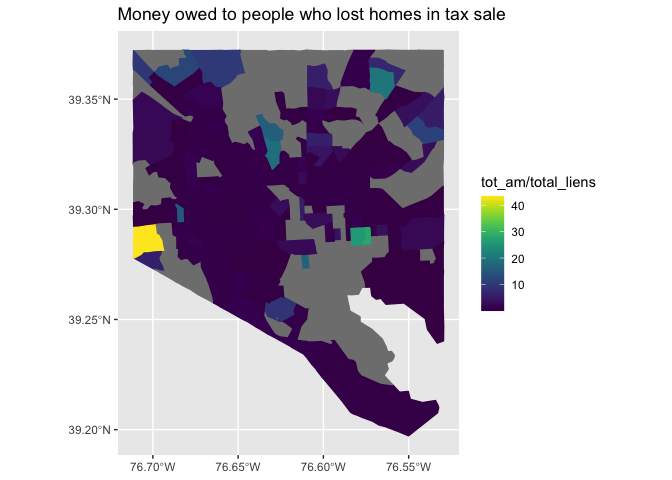

Excess Funds
================
Nick Thieme
2023-02-06

### Introduction

This is the code that goes with the story
`Tax sale foreclosure costs Baltimore residents their homes and equity. The city does nothing to help them get the small amount they’re owed`
located [here](link). In this story, Sophie Kasakove and I take a look
at the excess funds list–the amount of money the City of Baltimore owes
to property owners who have lost their homes through tax sale
foreclosure.

### Parsing the data

The statistics in this story are very simple. The only slight difficulty
is turning the excess funds pdf into a csv. We do that in thie code
chunk here.

Unsurprisingly, the majority of the funds owed by the City are located
in the Black Butterly. This makes sense because excess funds are
downstream of sold homes, and sold homes are in the Black Butterfly. All
of the homes identified as sold through tax sale since 2016 have been in
Black Butterfly. The reason why we see excess funds outside this area at
all is because the excess funds list has no expiration date on it. We
write out the geojson for this here.

``` r
Bmore_acs<-get_acs(geography = "tract", state = "MD",county = "Baltimore city",
                   variables=c(med_inc="B19013_001",white = "B02001_002", 
                               black = "B02001_003", 
                               poverty = "B17001_002"), geometry = T, summary_var = "B01001_001"
)%>% pivot_wider(-c(GEOID, moe),names_from = "variable", values_from = "estimate") %>% 
  mutate(blk_perc = black/summary_est, wht_perc = white/summary_est, pov_rate = poverty/summary_est) %>% st_as_sf
```

    ## Getting data from the 2016-2020 5-year ACS

    ## Downloading feature geometry from the Census website.  To cache shapefiles for use in future sessions, set `options(tigris_use_cache = TRUE)`.

    ##   |                                                                              |                                                                      |   0%  |                                                                              |=                                                                     |   1%  |                                                                              |=                                                                     |   2%  |                                                                              |==                                                                    |   2%  |                                                                              |==                                                                    |   3%  |                                                                              |===                                                                   |   4%  |                                                                              |====                                                                  |   5%  |                                                                              |====                                                                  |   6%  |                                                                              |=====                                                                 |   7%  |                                                                              |=====                                                                 |   8%  |                                                                              |======                                                                |   9%  |                                                                              |=======                                                               |  10%  |                                                                              |========                                                              |  11%  |                                                                              |=========                                                             |  13%  |                                                                              |==========                                                            |  14%  |                                                                              |===========                                                           |  16%  |                                                                              |============                                                          |  17%  |                                                                              |=============                                                         |  19%  |                                                                              |===============                                                       |  21%  |                                                                              |=================                                                     |  24%  |                                                                              |==================                                                    |  25%  |                                                                              |====================                                                  |  29%  |                                                                              |======================                                                |  31%  |                                                                              |========================                                              |  34%  |                                                                              |=========================                                             |  36%  |                                                                              |===========================                                           |  38%  |                                                                              |=============================                                         |  42%  |                                                                              |=================================                                     |  47%  |                                                                              |===================================                                   |  51%  |                                                                              |=====================================                                 |  53%  |                                                                              |=======================================                               |  56%  |                                                                              |==========================================                            |  60%  |                                                                              |============================================                          |  62%  |                                                                              |==============================================                        |  65%  |                                                                              |====================================================                  |  75%  |                                                                              |======================================================                |  77%  |                                                                              |=========================================================             |  81%  |                                                                              |===========================================================           |  84%  |                                                                              |=============================================================         |  87%  |                                                                              |===============================================================       |  90%  |                                                                              |================================================================      |  91%  |                                                                              |===================================================================== |  98%  |                                                                              |======================================================================| 100%

``` r
D_excess_funds_geocoded <- read_csv("~/Desktop/banner_projects/real_estate/excess_funds_list_2_geocodio_1701cf4c732b384328a711a38efa2ea91c4829a0.csv") %>% 
  select(property_address, owner_name,tax_sale_date,deed_delivered_date,unclaimed_amount,total_lien,Latitude,Longitude) %>% 
  st_as_sf(coords = c("Longitude", "Latitude"))
```

    ## Rows: 2132 Columns: 20

    ## ── Column specification ────────────────────────────────────────────────────────
    ## Delimiter: ","
    ## chr  (12): property_address, owner_name, Accuracy Type, Number, Street, Unit...
    ## dbl   (6): unclaimed_amount, total_lien, Latitude, Longitude, Accuracy Score...
    ## date  (2): tax_sale_date, deed_delivered_date
    ## 
    ## ℹ Use `spec()` to retrieve the full column specification for this data.
    ## ℹ Specify the column types or set `show_col_types = FALSE` to quiet this message.

``` r
st_crs(D_excess_funds_geocoded)<-st_crs(Bmore_acs)

D_excess_acs<-Bmore_acs %>% st_join(D_excess_funds_geocoded)
D_excess_acs_points<-Bmore_acs %>% st_join(D_excess_funds_geocoded)

##black butterfly
D_excess_acs_cens<-D_excess_acs %>% data.frame %>% #filter(tax_sale_date>ymd("2018-01-01")) %>% 
  group_by(NAME) %>% 
  summarise(tot_am = sum(unclaimed_amount), 
            total_liens = sum(total_lien),
            geometry = geometry[1], 
            n = n(), 
            blk_perc=blk_perc[1]) %>% 
  mutate(tot_am = replace_na(tot_am,0)) %>% st_as_sf

D_excess_acs_cens %>% ggplot(aes(color = tot_am/total_liens, fill = tot_am/total_liens))+geom_sf()+scale_color_viridis()+scale_fill_viridis()+
  labs(title = "Money owed to people who lost homes in tax sale")
```

<!-- -->

``` r
props<-D_excess_acs_cens %>% st_transform(4326) %>% add_column(id = 1:nrow(.))

st_write(props%>% select(geometry) %>% add_column(id = 1:nrow(.)), dsn = "~/Desktop/banner_projects/real_estate/excess_funds.geojson",
         layer = "city_tracts", driver = "GeoJSON", delete_dsn = T)
```

    ## Deleting source `/Users/nickthieme/Desktop/banner_projects/real_estate/excess_funds.geojson' using driver `GeoJSON'
    ## Writing layer `city_tracts' to data source 
    ##   `/Users/nickthieme/Desktop/banner_projects/real_estate/excess_funds.geojson' using driver `GeoJSON'
    ## Writing 199 features with 1 fields and geometry type Multi Polygon.

``` r
props%>% data.frame  %>% write_csv("~/Desktop/banner_projects/real_estate/excess_funds.csv")
```

Here we run the simple statistics we use in the story

``` r
#amounts
#D_excess_acs_points %>% arrange(desc(unclaimed_amount)) %>% head(10) %>% select(property_address,deed_delivered_date, unclaimed_amount)

D_excess_acs_points %>% filter(unclaimed_amount>20000) %>% nrow 
```

    ## [1] 55

``` r
D_excess_acs_points %>% filter(unclaimed_amount>80000) %>% nrow  
```

    ## [1] 9

``` r
D_excess_acs_points %>% pull(unclaimed_amount) %>% na.omit %>%  median  
```

    ## [1] 582.16

``` r
D_excess_funds_geocoded %>% mutate(time_since_deed = ymd("2022-01-01")-deed_delivered_date) %>% pull(time_since_deed) %>% mean
```

    ## Time difference of 2549.365 days

We use having ” LL” in the owner name as a proxy for the number of homes
that are owned by LLC’s as opposed to individuals.

``` r
###connecting the city building data with the excess funds list 
# j_city_state_data_sf<-st_read("~/Desktop/banner_projects/real_estate/fixed_parcel_data.shp") 
# name_file_shapes <- read_csv("~/Desktop/banner_projects/real_estate/fixed_parcel_names.csv" )
# names(j_city_state_data_sf)<-name_file_shapes$`names(j_city_state_data_sf)`
# 
# D_excess_funds_match_f<-D_excess_funds_f_pm_2_add_f %>%
#   mutate(pm.house = pm.house %>% str_remove(., "^0+") %>% str_remove(., ">"))%>% 
#   mutate(pm.house=str_split(pm.house,"-") %>% lapply(function(x)return(x[1])) %>% unlist,
#          pm.preDir=replace_na(pm.preDir,""),
#          pm.streetSuf=replace_na(pm.streetSuf,""),
#          pm.addr.full = str_c(pm.house, " ",pm.preDir, " ",pm.address," ", pm.streetSuf) %>% trimws %>% 
#            str_replace("  "," ") %>% str_replace("  "," ") %>% tolower) %>% select(pm.uid,pm.addr.full)%>%
#   mutate(pm.addr.full = str_remove(pm.addr.full, "\\#+[0-9]*") %>% trimws %>% str_remove_all("\\.")) %>% 
#   rename(pm.addr.full.bidder = pm.addr.full)
# 
# D_excess_funds_match_f_n<-D_excess_funds_f_pm %>% left_join(D_excess_funds_match_f, by = "pm.uid") %>% 
#   select(-pm.id,-pm.uid, -pm.type) %>% as.data.frame
# 
# matched_excess_city_prop<-D_excess_funds_match_f_n %>% left_join(j_city_state_data_sf, by = c("pm.addr.full.bidder"="pm.addr.full.sdat"))
# 
# #checking missed matches. 28/2143 1.3%
# matched_excess_city_prop %>% filter(is.na(id_city)) %>% nrow

#2115 matched
# matched_excess_city_prop %>% filter(is.na(id_city)==FALSE) %>% nrow
# matched_excess_city_prop %>% filter(str_detect(owner_name, "LLC")) %>% nrow

D_excess_funds_geocoded %>% filter(str_detect(owner_name, " LL")) %>% nrow
```

    ## [1] 301

``` r
D_excess_funds_geocoded %>% nrow
```

    ## [1] 2132
